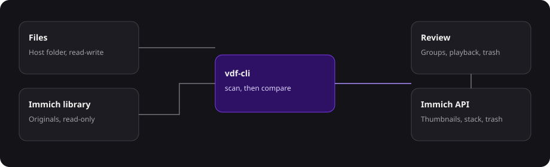

# immich-vdf

Find duplicate photos and videos, compare them, and clear the ones you do not want. One app covers a normal folder and an [Immich](https://immich.app) library.



The duplicate engine is [Video Duplicate Finder](https://github.com/0x90d/videoduplicatefinder) v4.1.1, built into the image. This repository is the web app and the engine source it ships. It is [AGPL-3.0](LICENSE).

## Run it

Install Docker. In an empty directory, save [docker-compose.example.yml](docker-compose.example.yml) as `docker-compose.yml` and [.env.example](.env.example) as `.env`. That directory does not need this source tree.

Set three values in `.env`:

| Variable | What to put |
| --- | --- |
| `APP_PASSWORD` | Password for the web UI, at least 8 characters. `change-me` in the example is refused at startup |
| `MEDIA_PATH` | Host folder of videos and photos to scan. Trash stays inside this folder. |
| `IMMICH_PATH` | Same host path as Immich's `UPLOAD_LOCATION` |

```bash
docker compose up -d
```

Open `http://<host>:4747`.

That command pulls `vinrosso/immich-vdf:latest`. It does not compile anything. GitHub Actions publishes the image when a `v*` tag is pushed. Mounts, the optional proxy range, and extra Immich libraries are in [Install](docs/install.md) and [Configuration](docs/configuration.md).

## What you can do

- **Files** scans `MEDIA_PATH`. Deleting a duplicate renames it into `.vdf-trash/` on that same folder.
- **Immich** scans the library mount read-only. Posters for matched assets come from the Immich API. Stack, unstack, and trash go through the API.
- Each section has its own scan database and its own schedule.
- The viewer stays on the current group after an action, and moves on only when that group is gone.

Day-to-day use is in [Using immich-vdf](docs/usage.md). How the password, mounts, and network fit together is in [Security](docs/security.md).

## Documentation

| | |
| --- | --- |
| [Install](docs/install.md) | Docker, the first start, where data lives |
| [Configuration](docs/configuration.md) | `.env`, volumes, schedules, the Immich API key |
| [Usage](docs/usage.md) | Scans, the viewer, trash, stacks |
| [Development](docs/development.md) | Local app, tests, building the image |
| [Updating VDF](FORK.md) | Pull a newer upstream engine tag |
| [Security](docs/security.md) | What a signed-in user can reach |

## Develop

The web app and `vdf-cli` build on your machine without Docker. You need Node.js 22, the .NET 10 SDK, and `ffmpeg` / `ffprobe` on `PATH`.

```bash
npm install
cp .env.example .env
npm run dev
```

`npm run dev` builds `vdf-cli` from `engine/` when the binary is missing. To run the container from this checkout, `docker compose up -d` builds `immich-vdf:local` and does not pull from Docker Hub. Details are in [Development](docs/development.md).

To move the engine to a newer Video Duplicate Finder release:

```bash
npm run update-engine -- v4.1.1
```

That replaces `engine/VDF.Core` and `engine/VDF.CLI` from the upstream tag. It does not download a prebuilt `vdf-cli`.
