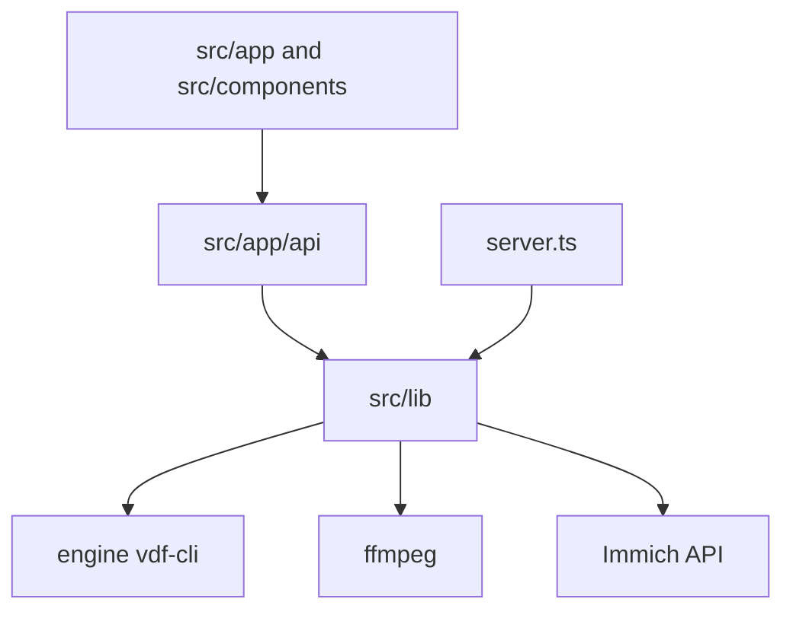

# Code

## On this page

- [Process](#process)
- [Pages](#pages)
- [HTTP API](#http-api)
- [Libraries](#libraries)
- [Engine](#engine)

This is a map of the repository, not an API reference. Start at [`server.ts`](https://github.com/vinRosso/immich-vdf/blob/main/server.ts) and [`src/lib/jobs.ts`](https://github.com/vinRosso/immich-vdf/blob/main/src/lib/jobs.ts).

## Process

`server.ts` is the process Compose starts. It checks `APP_PASSWORD`, starts the scheduler, and hands HTTP to Next.js. It also serves raw media and ffmpeg streams through `src/server/raw.ts` and `src/server/media.ts`. `next start` is not used.

One scan runs at a time. The scheduler in `src/lib/scheduler.ts` only starts a scan. It does not stack or trash.

## Pages

| Route | Screen |
| --- | --- |
| `/` | `src/components/home-screen.tsx` |
| `/immich`, `/server` | `src/components/section-screen.tsx` |
| `/login` | `src/components/login-form.tsx` |
| `/trash`, `/ignored` | Trash and ignored lists |

`section-screen.tsx` is the scan page: profiles, folders, schedule dialog, results grid. `viewer.tsx` is the compare dialog: playback, photo zoom, difference blend, stack, trash, extract.

## HTTP API

Routes live under `src/app/api/`. Each handler uses `src/lib/route.ts`, which checks the session.

| Area | Routes |
| --- | --- |
| Scan | `/api/scan`, `/api/scan/cancel`, `/api/runs`, `/api/results` |
| Groups | `/api/results/merge`, `/api/results/extract`, `/api/ignore` |
| Files trash | `/api/trash` |
| Immich | `/api/immich/stack`, `/api/immich/trash`, albums, status, test |
| Settings | `/api/settings`, `/api/folders`, `/api/webhook/test` |
| Playback | `/api/media`, `/api/media/info` |

## Libraries

| Path | Role |
| --- | --- |
| `src/lib/jobs.ts` | Scan, compare, save results, fire the webhook |
| `src/lib/cli-args.ts`, `parse-results.ts` | Flags sent to `vdf-cli`, and the JSON that comes back |
| `src/lib/scan-profiles.ts` | Exact, edited, AI, and deep presets |
| `src/lib/actions.ts` | Trash, stack, ignore, merge, extract |
| `src/lib/merge-groups.ts` | Combine two groups, or split a selection into a new one |
| `src/lib/immich.ts` | Immich HTTP client |
| `src/lib/immich-path-map.ts`, `immich-join.ts` | Mount path to Immich asset |
| `src/lib/store.ts` | Settings and secrets on the data volume |
| `src/lib/session.ts`, `password.ts`, `urls.ts`, `path-jail.ts` | Sign-in, outbound URL checks, file jail |

The browser never receives the Immich API key. `store.ts` keeps it on disk. Settings responses send `apiKeyConfigured`.

## Engine

`engine/VDF.Core` and `engine/VDF.CLI` are the vendored duplicate finder. `engine/VDF.ForkTests` is ours. How to replace the pin is on [Engine](dev-engine).
