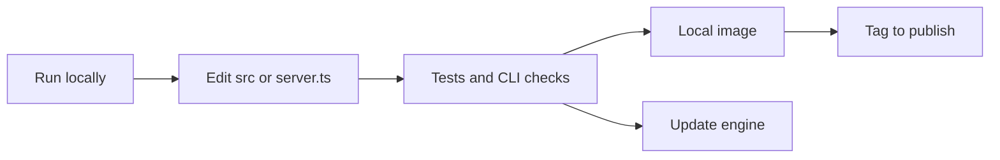

# Development

Users pull the Docker image. This section is for changing the app or the engine.

| Step | Page |
| --- | --- |
| Run the app on your machine | [Local app](dev-local) |
| Prove a change | [Checks](dev-checks) |
| Build what Compose runs here | [Image](dev-image) |
| Pull a newer Video Duplicate Finder tag | [Engine](dev-engine) |
| Find the module that owns a behavior | [Code](code) |

`server.ts` is the process Compose starts. `next start` is not used.

| Path | Role |
| --- | --- |
| `engine/` | VDF.Core, VDF.CLI, and the upstream pin |
| `server.ts` | HTTP server, scheduler, scan job, ffmpeg streaming |
| `src/` | Next.js UI and JSON API |
| `fixtures/cli-results.json` | Parser contract for tests and the image build |
| `docs/immich-vdf-plan.md` | Design notes. Not published on the docs site. |
