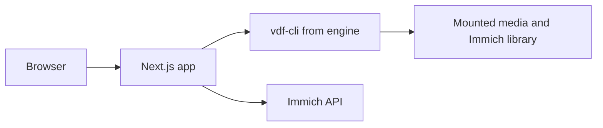

# immich-vdf

immich-vdf is a web app on top of [Video Duplicate Finder](https://github.com/0x90d/videoduplicatefinder). `engine/` holds VDF.Core and VDF.CLI from v4.1.1 (`21ec967`). Users pull the published image. The image build compiles that CLI, then the Next.js app. Their code is AGPLv3. The image build runs `vdf-cli --help` and parses a checked-in JSON fixture through our parser, so a CLI flag or output change fails the build instead of a scan at 3 a.m.

Immich library is mounted on the same server (read-only). Immich deletes go through the API.

## Deploy

One Compose service, built from a multi-stage [Dockerfile](../Dockerfile):

- Build `vdf-cli` from `engine/` (.NET 10). The runtime stage deletes `engine/` after publish so the image does not carry the C# sources.
- Build the Next.js app.
- Runtime image: .NET 10 runtime, Node, ffmpeg, and ffprobe from the distro. VDF runs ffmpeg in process mode; the native binding needs FFmpeg 8 shared libraries and is not used.

[docker-compose.yml](../docker-compose.yml) publishes an uncommon host port, sets `APP_PASSWORD`, and mounts:

- Files media mount, read-write. Deletes move files into a `.vdf-trash/` folder at the root of that same mount, so it is a rename, not a copy, and the data volume does not fill up.
- Immich library, read-only, plus a path map from Immich `originalPath` (often `/usr/src/app/upload` or an external-library path) to that mount.
- A data volume for settings, results, thumbnails, and two separate VDF scan databases, one per section, so rescans stay fast and Files and Immich do not share hashes. The app creates `/data/db/server` and `/data/db/immich` and passes `--db` to each.

## App

Next.js, TypeScript, Tailwind, shadcn/ui, started from a small custom Node server (`server.ts`) rather than `next start`. That server owns the scheduler loop, the single running scan, and long-lived ffmpeg pipes. Two sections in one UI. A password cookie guards both. The API key is stored on the data volume and is never returned to the browser.

One scan at a time. The CLI log streams to the page. JSON is read from `--output`. The latest result set for each section is stored on the data volume.

### Files

Include and exclude directories, rejected unless they sit inside the mounted roots. Threshold, percent, parallelism, images, pHash, partial-clip, and AI flags are passed through to the CLI.

When a scan finishes, ffmpeg writes JPEGs for every file in the results: one poster at about 10% of the duration, plus a short filmstrip for the viewer. Thumbnail concurrency is a Files setting; the UI suggests half the CPU cores, clamped between 1 and 4.

### Immich

Save the base URL and API key, then check the connection. Page assets with `POST /api/search/metadata`. Scan the mounted tree. Join each CLI path back through the path map to `originalPath`, then to an asset id. Thumbnails are proxied from Immich.

Per group, the highest bitrate / resolution is preselected as the primary. **Stack** calls `POST /api/stacks`. **Trash others** calls `DELETE /api/assets` without `force`.

### Viewer

Comparison viewer with synced players and partial-clip seek via `PartialClipOffset`.

### HTTP streaming

HTTP range requests for browser-safe codecs; on-demand fragmented MP4 transcode otherwise. Immich playback uses the mounted file, not an API download.

### Schedules

Per-section daily or weekly scans only (no auto stack/delete). Optional webhook on finish.

### Ignore list and trash

Ignore by whole group member set. Files trash is `.vdf-trash/` on the media mount.

### Security

LAN or reverse proxy only. Path jail, no shell interpolation for CLI/ffmpeg, secrets on data volume, Immich mount read-only.

## Not in this slice

Multiple users, downloading originals over the API, automatic stack or delete on a schedule, and pre-building HLS or DASH for the library.
