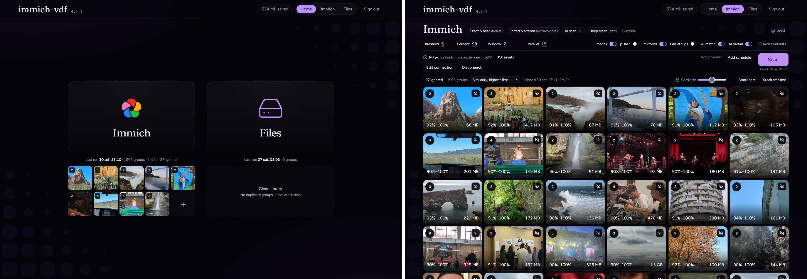

# immich-vdf

## On this page

- [Users](#users)
- [Developers](#developers)

Find duplicate photos and videos, compare them, and clear the ones you do not want.

**Immich** is for an Immich library. **Files** is for an external library Immich already reads.

## Users

1. [Installation](install), including configuration
2. [Usage](usage)

There are also some [Shortcuts](shortcuts) for better UX.

## Developers

Start at [Development](development). The module map is [Code](code).
