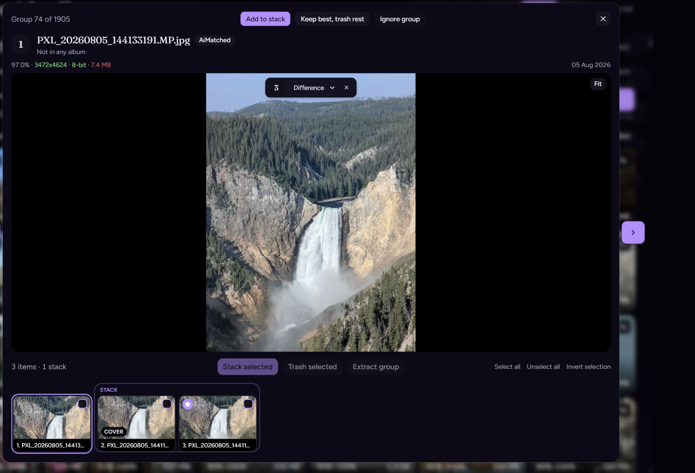

# Photos

## On this page

- [Zoom](#zoom)
- [Difference](#difference)
- [Keys](#keys)

A group of only images shows one photo, a **Fit** button, and a filmstrip.

## Zoom

| Action | Result |
| --- | --- |
| Scroll wheel | Zoom toward the pointer |
| Drag the photo | Pan |
| Double-click, or **Fit** | Back to the fitted view |

## Difference

Drag a filmstrip thumbnail onto the photo. The dropped image is blended on top. **Difference** is the default: pixels that match go dark, pixels that differ stay bright.

The menu also has Exclusion, Multiply, Screen, Overlay, Darken, and Lighten. The number on the control is the filmstrip item you dropped. **X** clears it.

## Keys

| Key | Action |
| --- | --- |
| `1`–`9` | Show that item. `1` is the first. |
| `0` | Show the best item |
| `Enter` or `Space` | Show the filmstrip thumbnail that has focus |

`Left` and `Right` still change the group. The full list is [Shortcuts](shortcuts).
