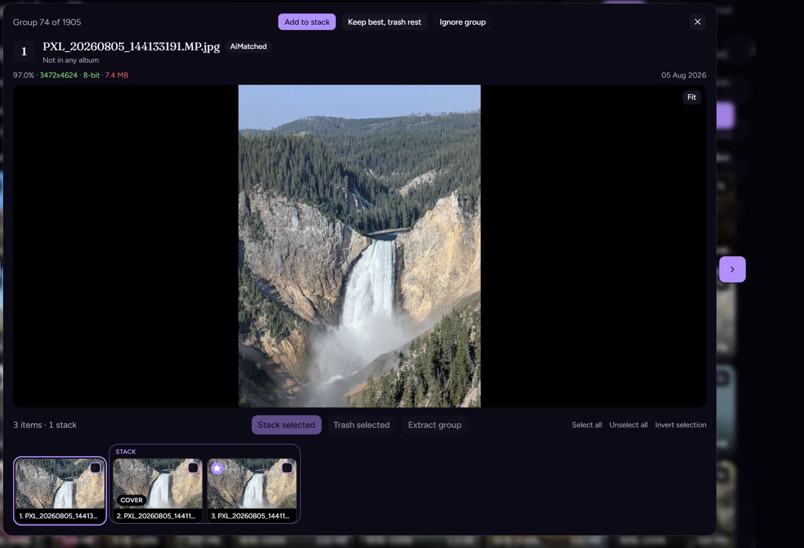

# Review

## On this page

- [Keys](#keys)
- [After an action](#after-an-action)

Open a group from the grid. [Photos](photos) covers zoom and difference. [Groups](groups) covers merge and extract.

## Keys

| Key | Action |
| --- | --- |
| `Left` | Previous group |
| `Right` | Next group |

These do nothing while you are typing in a field. With the video slider focused, `Left` and `Right` move through the clip instead. The rest of the keys are on [Shortcuts](shortcuts).

## After an action

| What you did | Where you land |
| --- | --- |
| Stack, trash, or ignore, and the group still has files | Same group |
| The group is gone | Next group |
| Close | You leave the group. Nothing is changed. |

Playback uses the original file when the browser can play it, and an ffmpeg stream otherwise. Filmstrip frames are cut from that file.

Videos play side by side and stay in sync. Photos use one frame at a time.
