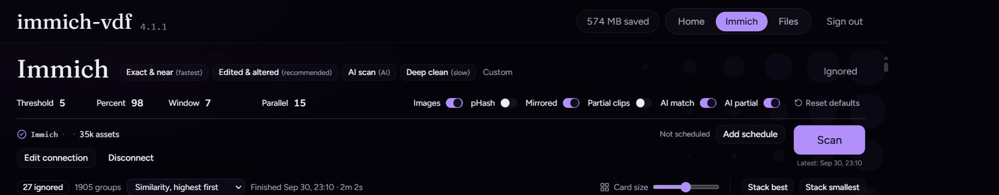

# Scan

## On this page

- [Which profile](#which-profile)
- [Knobs worth leaving alone](#knobs-worth-leaving-alone)

Open **Immich** or **Files**, pick a profile, and press **Scan**. Only one scan runs at a time, on either page.

A scan runs `vdf-cli scan`, then `vdf-cli compare`. If the files and the settings have not changed, compare is skipped and the previous groups stay.

## Which profile

| Profile | Use it when | Cost |
| --- | --- | --- |
| **Exact & near** | Copies, renames, and re-encodes. Percent 98. | Fastest |
| **Edited & altered** | Crops, watermarks, flips, quality changes. Percent 92. Mirrored on. | Recommended first pass |
| **AI scan** | Re-edited copies and clips cut from longer videos, without decoding audio. | First run downloads about 100 MB |
| **Deep clean** | Everything above, plus audio fingerprints for a clip inside a longer file. | Slowest |

> Start with **Edited & altered**. Move to **AI scan** when crops and re-edits are still missing. Use **Deep clean** only when you need those partial clips.

## Knobs worth leaving alone

| Control | Suggestion |
| --- | --- |
| Threshold | Leave at 5. Lower is stricter and drops real duplicates. |
| Percent | Let the profile set it (98 or 92). A much lower percent fills the grid with weak matches. |
| Window | Immich defaults to 7 days, so a burst of the same event is compared. Files defaults to 0, the whole library. Raise the Immich window only when the same photo was imported months apart. |
| Parallel | Use the suggested value for the CPUs inside the container. |
| Images | Leave on unless you only care about video. |
| pHash | Off unless you already know you want perceptual hashes instead of frame samples. |

**Reset defaults** returns the knobs to the built-in baseline, which is not the same as a profile. Pick the profile again after a reset.

Include at least one folder. Exclude a folder when you know it should never be compared.

A schedule is separate from the controls on the page. See [Schedule and webhook](schedule).
