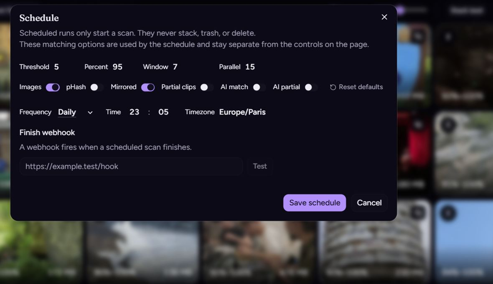

# Schedule and webhook

## On this page

- [Webhook](#webhook)

**Add schedule** saves a daily or weekly run for that page only. The matching options in the dialog belong to the schedule. They do not change the controls on the page.

A scheduled run only starts a scan. It never stacks, trashes, or deletes.



The clock uses the time zone you pick, not the host zone. Delete the schedule to stop the runs. That also removes the saved webhook. Scan settings on the page stay as they are.

## Webhook

The finish webhook is one URL for the app. It runs when a **scheduled** scan finishes. Pressing **Scan** does not call it.

It also runs when a scheduled start is skipped because a scan is already running.

**Test** sends a sample and waits for a response under 10 seconds. The URL has to be `http` or `https`. Loopback, link-local, and cloud metadata addresses are refused. A LAN address is allowed.

```json
{
  "section": "immich",
  "status": "ok",
  "groupCount": 12
}
```

| Field | Values |
| --- | --- |
| `section` | `immich` for the Immich page, `server` for the Files page |
| `status` | `ok`, `error`, or `skipped` |
| `groupCount` | Groups left after a finished scan. `0` on a test or a skip. |

A response of 300 or higher is a failure. The scan itself is already saved. The failure is only a line in the scan log.
