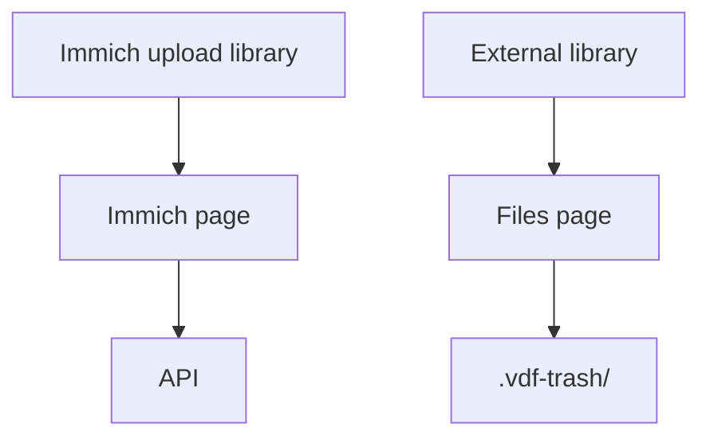

# Usage

## On this page

- [Pages](#pages)

Sign in with `APP_PASSWORD`. Home shows a preview of the latest Immich groups and the latest Files groups.

The two pages do not share a scan database.

| Page | Point it at | A delete |
| --- | --- | --- |
| **Immich** | Immich's upload library | Stack or trash through the Immich API |
| **Files** | An external library Immich reads | Rename the file into `.vdf-trash/` on that folder |

> Do not scan the same files on both pages.

After a Files delete, Immich still lists the asset until it scans that external library again.

## Pages

1. [Two libraries](libraries)
2. [Immich](immich)
3. [Files](files)
4. [Scan](scan), then [Schedule and webhook](schedule)
5. [Review](review), then [Photos](photos) and [Groups](groups)
6. [Shortcuts](shortcuts)
